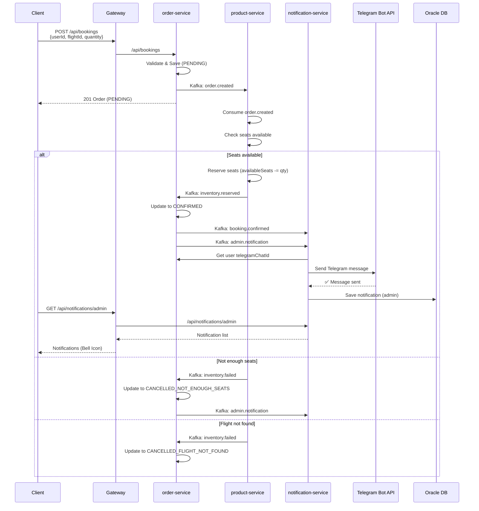

# Hệ Thống Đặt Vé Máy Bay - Kiến Trúc Microservices

## Mục lục

1. [Giới thiệu](#1-giới-thiệu)
2. [Tech Stack](#2-tech-stack)
3. [Kiến trúc hệ thống](#3-kiến-trúc-hệ-thống)
4. [Sơ đồ luồng nghiệp vụ](#4-sơ-đồ-luồng-nghiệp-vụ)
5. [Các service](#5-các-service)
6. [Luồng Kafka - Saga Pattern](#6-luồng-kafka---saga-pattern)
7. [Cấu trúc Database](#7-cấu-trúc-database)
8. [API Endpoints](#8-api-endpoints)
9. [Bảo mật](#9-bảo-mật)
10. [Resilience & Observability](#10-resilience--observability)
11. [Cách chạy](#11-cách-chạy)

---

## 1. Giới thiệu

Đồ án xây dựng **hệ thống đặt vé máy bay** theo kiến trúc **Microservices** với các đặc điểm:

- **5 backend services** độc lập, mỗi service có database riêng (Oracle XE, tách schema)
- **Giao tiếp bất đồng bộ** qua **Apache Kafka** (choreography-based Saga pattern)
- **API Gateway** tập trung điều hướng request
- **Telegram Bot** gửi thông báo real-time cho khách hàng
- **Resilience4j Circuit Breaker** bảo vệ booking flow khi service phụ thuộc bị sập
- **Distributed Tracing** qua Zipkin, **Centralized Logging** qua ELK stack
- **Frontend ReactJS** kết nối qua Gateway

---

## 2. Tech Stack

| Layer | Technology | Version | Mục đích |
|---|---|---|---|
| **Backend** | Java 17 | 17 | Ngôn ngữ chính |
| **Framework** | Spring Boot | 3.2.0 | Khung ứng dụng |
| **API Gateway** | Spring Cloud Gateway | 4.x | Điều hướng request |
| **Frontend** | ReactJS | 18.x | Giao diện người dùng |
| **Database** | Oracle XE | 21 | Mỗi service 1 schema riêng |
| **Message Queue** | Apache Kafka | 7.6.1 | Bất đồng bộ, Saga pattern |
| **Authentication** | JWT (jjwt) | 0.12.6 | Xác thực stateless |
| **Password** | BCrypt | - | Mã hóa mật khẩu |
| **Circuit Breaker** | Resilience4j | - | Chống cascade failure |
| **Tracing** | Micrometer + Zipkin | - | Distributed tracing |
| **Logging** | ELK Stack | 8.x | Tập trung log (commented) |
| **Container** | Docker Compose | - | Đóng gói & triển khai |
| **Bot Notification** | Telegram Bot API | - | Gửi thông báo Telegram |

---

## 3. Kiến trúc hệ thống

### 3.1 Sơ đồ kiến trúc tổng quan

```
┌──────────────────────────────────────────────────────────────────────────────────┐
│                                    CLIENTS                                        │
│                                                                                   │
│  ┌─────────────────────┐              ┌─────────────────────┐                     │
│  │  Trình duyệt        │              │  Telegram Bot       │                     │
│  │  Frontend (ReactJS)  │              │  (Thông báo)        │                     │
│  │  :3000               │              │                     │                     │
│  └──────────┬──────────┘              └──────────┬──────────┘                     │
│             │                                  │                                  │
└─────────────┼──────────────────────────────────┼──────────────────────────────────┘
              │                                  │
              │ HTTP/REST                        │ Telegram Bot API
              │ (JWT Token)                      │ (HTTPS)
              ▼                                  ▼
┌──────────────────────────────────────────────────────────────────────────────────┐
│                              API GATEWAY (Port 8080)                              │
│                        Spring Cloud Gateway - Điều hướng route                    │
│                                                                                   │
│  /api/auth/**          → user-service:8081                                       │
│  /api/users/**         → user-service:8081   (có JWT)                             │
│  /api/products/**      → product-service:8082 (có JWT)                            │
│  /api/flights/**       → product-service:8082 (có JWT)                            │
│  /api/orders/**        → order-service:8083    (có JWT)                           │
│  /api/bookings/**      → order-service:8083    (có JWT)                           │
│  /api/notifications/** → notification-service:8084 (có JWT)                       │
└──────────────────────────────────────────────────────────────────────────────────┘
              │
              │ HTTP/REST (JWT)          HTTP/REST (no JWT - internal)
              ▼                          ▼
┌─────────────┼────────────────────────────────────────────────────────────────────┐
│             │              BACKEND MICROSERVICES                                  │
│             │                                                                     │
│  ┌──────────┴──────┐  ┌───────────┴───────┐  ┌───────────┴───────┐               │
│  │  user-service   │  │  product-service  │  │  order-service    │               │
│  │  Port: 8081     │  │  Port: 8082       │  │  Port: 8083       │               │
│  │  Schema:        │  │  Schema:          │  │  Schema:          │               │
│  │  USER_APP       │  │  PRODUCT_APP      │  │  ORDER_APP        │               │
│  │                 │  │                   │  │                   │               │
│  │ - User CRUD     │  │ - Flight CRUD     │  │ - Tạo booking     │               │
│  │ - Auth (JWT)    │  │ - Tìm kiếm        │  │ - Quản lý đơn     │               │
│  │ - Telegram ID   │  │ - Cập nhật ghế    │  │ - Publish Kafka   │               │
│  └────────┬────────┘  └─────────┬─────────┘  └─────────┬─────────┘               │
│           │                     │                     │                           │
│           │◄────────────────────┤                     │                           │
│           │  REST call          │                     │                           │
│           │  (validate user)    │                     │                           │
│           │                     │◄────────────────────┤                           │
│           │                     │  REST call          │                           │
│           │                     │  (validate flight)  │                           │
└───────────┼─────────────────────┼─────────────────────┼───────────────────────────┘
            │                     │                     │
            │              Kafka Message Bus            │
            │              (kafka:9092)                 │
            │                     │                     │
            ▼                     ▼                     ▼
┌────────────────────────────────────────────────────────────────────────────────┐
│                           APACHE KAFKA (Message Broker)                        │
│                                                                                │
│  Topics:                                                                       │
│  ┌─────────────────┐  ┌─────────────────┐  ┌─────────────────┐                │
│  │ order.created   │  │ inventory.      │  │ booking.        │                │
│  │ (order-service  │  │ reserved        │  │ confirmed       │                │
│  │  → product)     │  │ (product →      │  │ (order-service  │                │
│  │                 │  │  order)         │  │  → notif)       │                │
│  └─────────────────┘  └─────────────────┘  └─────────────────┘                │
│  ┌─────────────────┐  ┌─────────────────┐                                      │
│  │ inventory.      │  │ admin.          │                                      │
│  │ failed          │  │ notification    │                                      │
│  │ (product →      │  │ (order-service  │                                      │
│  │  order)         │  │  → notif)       │                                      │
│  └─────────────────┘  └─────────────────┘                                      │
└────────────────────────────────────────────────────────────────────────────────┘
            │                     │                     │
            ▼                     ▼                     ▼
┌───────────┴─────────────────────┴─────────────────────┴───────────────────────┐
│                            notification-service (Port 8084)                    │
│                                  Schema: NOTIF_APP                            │
│                                                                               │
│  Kafka Consumers:                                                             │
│  - booking.confirmed (groupId: email-service)                                 │
│    → Gửi thông báo Telegram cho khách hàng                                    │
│  - admin.notification (groupId: notification-service)                         │
│    → Lưu notification vào DB, hiển thị trên AdminFlightTicketPage             │
│                                                                               │
│  REST Endpoints:                                                              │
│  - GET /api/notifications/admin → Danh sách thông báo admin                   │
│  - GET /api/notifications/admin/unread-count → Số thông báo chưa đọc          │
│  - PATCH /api/notifications/{id}/read → Đánh dấu đã đọc                       │
│  - PATCH /api/notifications/read-all → Đánh dấu đọc tất cả                    │
└────────────────────────────────────────────────────────────────────────────────┘
            │
            ▼
┌────────────────────────────────────────────────────────────────────────────────┐
│                              ORACLE XE DATABASE                                │
│                             Schemas tách biệt theo service                     │
│                                                                                │
│  ┌──────────────┐  ┌──────────────┐  ┌──────────────┐  ┌──────────────┐       │
│  │  USER_APP    │  │  PRODUCT_APP │  │  ORDER_APP   │  │  NOTIF_APP   │       │
│  │  (userpwd)   │  │  (productpwd)│  │  (orderpwd)  │  │  (notifpwd)  │       │
│  │              │  │              │  │              │  │              │       │
│  │ USERS        │  │ FLIGHTS      │  │ ORDERS       │  │ NOTIFICATIONS│       │
│  │ ROLES        │  │              │  │              │  │              │       │
│  │ USER_ROLES   │  │              │  │              │  │              │       │
│  └──────────────┘  └──────────────┘  └──────────────┘  └──────────────┘       │
└────────────────────────────────────────────────────────────────────────────────┘
```

### 3.2 Sơ đồ luồng Kafka (Saga Pattern)

```
┌──────────┐         ┌──────────────┐         ┌─────────────────┐
│  Client  │         │ order-service│         │ product-service │
└────┬─────┘         └──────┬───────┘         └────────┬────────┘
     │ POST /api/bookings   │                           │
     │──────────────────────►│                           │
     │                      │ Call user-service (REST)  │
     │                      │───────────────────────────►│
     │                      │◄───────────────────────────│
     │                      │ Call product-service (REST)│
     │                      │───────────────────────────►│
     │                      │◄───────────────────────────│
     │                      │                           │
     │                      │ Save order (PENDING)      │
     │                      │───────────┐               │
     │                      │           │               │
     │  Order (PENDING)     │◄──────────┘               │
     │◄─────────────────────│                           │
     │                      │                           │
     │                      │ publish: order.created ───┤
     │                      │───────────────────────────►│
     │                      │                           │
     │                      │                    ┌──────▼────────┐
     │                      │                    │OrderEventListener│
     │                      │                    │ - Check seats    │
     │                      │                    │ - Reserve seats  │
     │                      │                    └──────┬────────┘
     │                      │                           │
     │                      │ ◄─── publish:            │
     │                      │    inventory.reserved ◄──┤
     │                      │◄──────────────────────────┤
     │                      │                           │ publish: inventory.failed
     │                      │◄──────────────────────────┤ (khi hủy)
     │                      │                           │
     │    ┌─────────────────▼────────────────────────┐ │
     │    │      InventorySagaListener               │ │
     │    │  (topic: inventory.reserved)             │ │
     │    │  (topic: inventory.failed)               │ │
     │    └─────────────────┬────────────────────────┘ │
     │                      │                           │
     │                      │ Save order (CONFIRMED)    │
     │                      │───────────┐               │
     │                      │           │               │
     │                      │◄──────────┘               │
     │                      │                           │
     │                      │ publish: booking.confirmed ─┤
     │                      │───────────────────────────►│
     │                      │                           │
     │                      │ publish: admin.notification┤
     │                      │───────────────────────────►│
     │                      │                           │
┌────▼──────────────────────▼─────────────────────────────▼───────────────────────┐
│                        notification-service                                     │
│                                                                                │
│  ┌────────────────────────────────┐  ┌──────────────────────────────────────┐ │
│  │  NotificationEventListener     │  │  AdminNotificationListener           │ │
│  │  (topic: booking.confirmed)    │  │  (topic: admin.notification)         │ │
│  │  groupId: email-service        │  │  groupId: notification-service       │ │
│  └──────────────┬─────────────────┘  └──────────────┬───────────────────────┘ │
│                 │                                     │                         │
│                 │ Gọi user-service lấy telegramChatId│                         │
│                 │────────────────────────────────────►│                         │
│                 │                                     │                         │
│                 │ Gửi tin nhắn Telegram Bot           │ Save vào DB             │
│                 │ cho khách hàng                      │ NOTIFICATIONS           │
│                 │                                     │                         │
│                 └─────────────────────────────────────┘                         │
└─────────────────────────────────────────────────────────────────────────────────┘
```

---

## 4. Sơ đồ luồng nghiệp vụ

### 4.1 Luồng đặt vé (Booking Flow) - Sequence Diagram

```
┌─────┐      ┌──────┐      ┌──────┐      ┌──────┐      ┌──────┐      ┌──────┐
│Client│      │Gateway│      │ order │      │product│      │ notif │      │ Telegram │
│     │      │      │      │service│      │service│      │service│      │  Bot   │
└──┬──┘      └──┬───┘      └───┬────┘      └───┬────┘      └───┬────┘      └───┬───┘
   │           │              │              │              │              │
   │ POST /bookings          │              │              │              │
   │──────────►│──────────────►│              │              │              │
   │           │              │ Validate user│              │              │
   │           │              │─────────────►│              │              │
   │           │              │◄─────────────│              │              │
   │           │              │ Validate flight             │              │
   │           │              │─────────────►│              │              │
   │           │              │◄─────────────│              │              │
   │           │              │              │              │              │
   │           │              │ Save order (PENDING)        │              │
   │           │              │──────────────┘              │              │
   │           │              │              │              │              │
   │ 201 Created              │ Publish order.created       │              │
   │◄──────────│◄──────────────│              │              │              │
   │           │              │              │              │              │
   │           │              │              │ ◄── consume order.created ─── │
   │           │              │              │ Check seats & reserve         │
   │           │              │              │ Publish inventory.reserved    │
   │           │              │◄───────────────────────────│              │
   │           │              │              │              │              │
   │           │              │ ◄── consume inventory.reserved ──────────── │
   │           │              │ Update order CONFIRMED      │              │
   │           │              │──────────────┘              │              │
   │           │              │              │              │              │
   │           │              │ Publish booking.confirmed   │              │
   │           │              │───────────────────────────────────────────►│
   │           │              │              │              │              │
   │           │              │ Publish admin.notification│              │
   │           │              │───────────────────────────────────────────►│
   │           │              │              │              │              │
   │           │              │              │  ◄── consume booking.confirmed │
   │           │              │              │  Get user's telegramChatId    │
   │           │              │              │  Send Telegram message        │
   │           │              │              │──────────────────────────────►│
   │           │              │              │              │  ✈️ Notif sent │
   │           │              │              │              │◄──────────────│
   │           │              │              │              │              │
   │           │              │              │  ◄── consume admin.notification│
   │           │              │              │  Save notification to DB      │
   │           │              │              │              │              │
```

### 4.2 Mermaid Flowchart tổng hợp

```mermaid
flowchart TD
    subgraph Client
        A[Trình duyệt người dùng<br/>ReactJS :3000] 
        B[Telegram Bot<br/>Thông báo tự động]
    end

    subgraph Gateway[API Gateway<br/>Spring Cloud Gateway :8080]
        G[Routing & Auth]
    end

    subgraph UserService[user-service<br/>:8081<br/>USER_APP]
        U_Auth[Auth Controller<br/>JWT + BCrypt]
        U_User[User Controller<br/>CRUD + Telegram]
        U_DB[(USERS<br/>ROLES<br/>USER_ROLES)]
    end

    subgraph ProductService[product-service<br/>:8082<br/>PRODUCT_APP]
        P_Flight[Flight Controller<br/>CRUD chuyến bay]
        P_Kafka[OrderEventListener<br/>Kafka Consumer<br/>Reserve seats]
        P_DB[(FLIGHTS)]
    end

    subgraph OrderService[order-service<br/>:8083<br/>ORDER_APP]
        O_Booking[Booking Controller<br/>Tạo đơn hàng]
        O_Order[Order Controller<br/>Quản lý đơn]
        O_Saga[InventorySagaListener<br/>Kafka Consumer<br/>Complete Saga]
        O_DB[(ORDERS)]
    end

    subgraph Kafka[Apache Kafka<br/>kafka:9092]
        T1[order.created]
        T2[inventory.reserved]
        T3[inventory.failed]
        T4[booking.confirmed]
        T5[admin.notification]
    end

    subgraph NotifService[notification-service<br/>:8084<br/>NOTIF_APP]
        N_Customer[NotificationEventListener<br/>Gửi Telegram cho KH]
        N_Admin[AdminNotificationListener<br/>Lưu thông báo Admin]
        N_API[Notification Controller<br/>Bell Icon API]
        N_TG[TelegramService<br/>Gọi Bot API]
        N_DB[(NOTIFICATIONS)]
    end

    A -->|POST /api/auth/login| G
    G -->|→ user-service| U_Auth
    U_Auth --> U_DB
    U_Auth -->|JWT Token| G
    G -->|JWT| A

    A -->|POST /api/bookings| G
    G -->|→ order-service| O_Booking
    O_Booking -->|GET /api/users/{id}| G --> U_User
    O_Booking -->|GET /api/flights/{id}| G --> P_Flight
    O_Booking --> O_DB
    O_Booking -->|publish| T1

    T1 --> P_Kafka
    P_Kafka -->|Check seats| P_DB
    P_Kafka -->|reserved| T2
    P_Kafka -->|failed| T3

    T2 --> O_Saga
    O_Saga -->|CONFIRMED| O_DB
    O_Saga -->|publish| T4
    O_Saga -->|publish| T5

    T3 --> O_Saga
    O_Saga -->|CANCELLED| O_DB
    O_Saga -->|publish| T5

    T4 --> N_Customer
    N_Customer -->|GET telegramChatId| G --> U_User
    N_Customer --> N_TG
    N_TG -->|sendMessage| B

    T5 --> N_Admin
    N_Admin --> N_DB
    N_Admin --> N_API
    N_API --> A
```

---

## 5. Các service

### 5.1 user-service (Port 8081) - Schema: USER_APP

**Trách nhiệm:** Quản lý người dùng, xác thực (JWT), lưu Telegram Chat ID.

**Các thành phần chính:**

| Component | Mô tả |
|---|---|
| `AuthController` | `/api/auth/register` - Đăng ký tự động gán `ROLE_CUSTOMER`; `/api/auth/login` - Đăng nhập trả JWT; `/api/auth/me` - Lấy thông tin user hiện tại |
| `UserController` | CRUD user; `PATCH /api/users/{id}/telegram` - Cập nhật Telegram Chat ID |
| `JwtUtils` | Sinh, validate JWT token với jjwt 0.12.6 |
| `JwtAuthFilter` | Filter bắt request, extract và validate JWT |
| `SecurityConfig` | Cấu hình Spring Security - cho phép `/api/auth/**` và một số endpoint internal |
| `User Entity` | id, username, email, password (BCrypt), fullName, address, dateOfBirth, cccd, **telegramChatId**, enabled, roles |

**Database Tables:**
- `USERS` - Thông tin người dùng
- `ROLES` - Danh sách vai trò (ROLE_CUSTOMER, ROLE_ADMIN)
- `USER_ROLES` - Mapping user ↔ role (nhiều-nhiều)

---

### 5.2 product-service (Port 8082) - Schema: PRODUCT_APP

**Trách nhiệm:** Quản lý chuyến bay, kiểm tra và giữ ghế.

**Các thành phần chính:**

| Component | Mô tả |
|---|---|
| `ProductController` | CRUD chuyến bay qua `/api/products` và `/api/flights` |
| `OrderEventListener` | Kafka Consumer - nhận `order.created`, kiểm tra ghế, trừ `availableSeats`, publish kết quả |
| `Product Entity` | id, flightNumber, origin, destination, departureTime, arrivalTime, **availableSeats**, price, airline, aircraftType, status |

**Luồng xử lý OrderEventListener:**
1. Nhận `OrderCreatedEvent` từ topic `order.created`
2. Tìm flight theo `flightId`
3. Nếu flight không tồn tại → publish `inventory.failed` (reason: `FLIGHT_NOT_FOUND`)
4. Nếu `availableSeats < quantity` → publish `inventory.failed` (reason: `NOT_ENOUGH_SEATS`)
5. Nếu hợp lệ → `availableSeats -= quantity`, save → publish `inventory.reserved`

---

### 5.3 order-service (Port 8083) - Schema: ORDER_APP

**Trách nhiệm:** Xử lý đặt vé, điều phối saga, quản lý đơn hàng.

**Các thành phần chính:**

| Component | Mô tả |
|---|---|
| `BookingController` | `POST /api/bookings` - Tạo booking, validate, publish Kafka; `GET /api/bookings?userId=X` |
| `OrderController` | CRUD đơn hàng qua `/api/orders` |
| `InventorySagaListener` | Kafka Consumer - nhận `inventory.reserved` → CONFIRMED + publish notification; nhận `inventory.failed` → CANCELLED |
| `KafkaProducerConfig` | Cấu hình 2 ProducerFactory: `KafkaTemplate<String, String>` (string JSON) và `KafkaTemplate<String, Object>` (Object JSON) |
| `Circuit Breaker` | Resilience4j `bookingDependency` bảo vệ gọi user-service và product-service - nếu sập trả 503 |
| `OrderEntity` | id, userId, flightId, quantity, passengerName, customerEmail, totalAmount, status, createdAt |

**Các trạng thái đơn hàng:**

| Status | Ý nghĩa |
|---|---|
| `PENDING_INVENTORY` | Đơn tạo, đang chờ Kafka saga xử lý |
| `CONFIRMED` | Saga hoàn tất, ghế đã giữ, booking thành công |
| `CANCELLED_FLIGHT_NOT_FOUND` | Không tìm thấy chuyến bay |
| `CANCELLED_NOT_ENOUGH_SEATS` | Không đủ ghế |
| `CANCELLED_INVALID_QUANTITY` | Số lượng vé không hợp lệ |

---

### 5.4 notification-service (Port 8084) - Schema: NOTIF_APP

**Trách nhiệm:** Gửi thông báo Telegram cho khách hàng, lưu thông báo admin.

**Các thành phần chính:**

| Component | Mô tả |
|---|---|
| `NotificationEventListener` | Kafka Consumer - nhận `booking.confirmed` → gọi user-service lấy `telegramChatId` → gửi Telegram |
| `AdminNotificationListener` | Kafka Consumer - nhận `admin.notification` → lưu vào bảng NOTIFICATIONS |
| `TelegramService` | Gọi Telegram Bot API `https://api.telegram.org/bot{TOKEN}/sendMessage` |
| `NotificationController` | API cho frontend: list notifications, unread count, mark as read |

**Cấu hình Telegram:**
- Biến môi trường `TELEGRAM_BOT_TOKEN` trong docker-compose
- Mỗi user có `telegramChatId` lưu trong user-service

---

### 5.5 gateway (Port 8080)

**Spring Cloud Gateway** điều hướng tất cả request:

| Route | Target | Auth |
|---|---|---|
| `/api/auth/**` | user-service:8081 | Không cần |
| `/api/users/**` | user-service:8081 | JWT |
| `/api/products/**` | product-service:8082 | JWT |
| `/api/flights/**` | product-service:8082 | JWT |
| `/api/orders/**` | order-service:8083 | JWT |
| `/api/bookings/**` | order-service:8083 | JWT |
| `/api/notifications/**` | notification-service:8084 | JWT |

---

## 6. Luồng Kafka - Saga Pattern

### 6.1 Kafka Topics

| Topic | Publisher | Consumer | Event Payload |
|---|---|---|---|
| `order.created` | order-service | product-service | `OrderCreatedEvent` |
| `inventory.reserved` | product-service | order-service | `InventoryEvent` (reason: RESERVED) |
| `inventory.failed` | product-service | order-service | `InventoryEvent` (reason: NOT_ENOUGH_SEATS / FLIGHT_NOT_FOUND) |
| `booking.confirmed` | order-service | notification-service | `BookingConfirmedEvent` |
| `admin.notification` | order-service | notification-service | `AdminNotificationEvent` |

### 6.2 Event Payloads

**OrderCreatedEvent** (order → product):
```json
{
  "orderId": 1,
  "userId": 2,
  "flightId": 3,
  "quantity": 2,
  "customerEmail": "user@example.com",
  "passengerName": "Nguyen Van A"
}
```

**InventoryEvent** (product → order):
```json
{
  "orderId": 1,
  "flightId": 3,
  "quantity": 2,
  "reason": "RESERVED" | "NOT_ENOUGH_SEATS" | "FLIGHT_NOT_FOUND" | "INVALID_QUANTITY"
}
```

**BookingConfirmedEvent** (order → notification):
```json
{
  "orderId": 1,
  "userId": 2,
  "flightId": 3,
  "quantity": 2,
  "customerEmail": "user@example.com",
  "passengerName": "Nguyen Van A",
  "totalAmount": 3000000.0
}
```

**AdminNotificationEvent** (order → notification):
```json
{
  "orderId": 1,
  "flightId": 3,
  "passengerName": "Nguyen Van A",
  "customerEmail": "user@example.com",
  "quantity": 2,
  "totalAmount": 3000000.0,
  "status": "CONFIRMED" | "CANCELLED_..."
}
```

### 6.3 Consumer Groups

| Consumer Group | Service | Topics |
|---|---|---|
| `flight-service` | product-service | `order.created` |
| `order-service` | order-service | `inventory.reserved`, `inventory.failed` |
| `email-service` | notification-service | `booking.confirmed` |
| `notification-service` | notification-service | `admin.notification` |

### 6.4 Mermaid Sequence: Luồng đặt vé hoàn chỉnh



---

## 7. Cấu trúc Database

### 7.1 User Service - Schema USER_APP

```sql
CREATE TABLE USERS (
    ID            NUMBER PRIMARY KEY,
    USERNAME      VARCHAR2(50) UNIQUE NOT NULL,
    EMAIL         VARCHAR2(100) UNIQUE NOT NULL,
    PASSWORD      VARCHAR2(255) NOT NULL,       -- BCrypt encoded
    FULL_NAME     VARCHAR2(100),
    ADDRESS       VARCHAR2(255),
    DATE_OF_BIRTH DATE,
    CCCD          VARCHAR2(20),
    TELEGRAM_CHAT_ID VARCHAR2(50),              -- Telegram Chat ID cho thông báo
    ENABLED       NUMBER(1) DEFAULT 1,
    CREATED_AT    TIMESTAMP DEFAULT CURRENT_TIMESTAMP
);

CREATE TABLE ROLES (
    ID   NUMBER PRIMARY KEY,
    NAME VARCHAR2(50) UNIQUE NOT NULL
);

CREATE TABLE USER_ROLES (
    USER_ID NUMBER REFERENCES USERS(ID),
    ROLE_ID NUMBER REFERENCES ROLES(ID),
    PRIMARY KEY (USER_ID, ROLE_ID)
);
```

### 7.2 Product Service - Schema PRODUCT_APP

```sql
CREATE TABLE FLIGHTS (
    ID              NUMBER PRIMARY KEY,
    FLIGHT_NUMBER   VARCHAR2(20) UNIQUE NOT NULL,
    ORIGIN          VARCHAR2(10) NOT NULL,
    DESTINATION     VARCHAR2(10) NOT NULL,
    DEPARTURE_TIME  VARCHAR2(50) NOT NULL,
    ARRIVAL_TIME    VARCHAR2(50),
    AVAILABLE_SEATS NUMBER NOT NULL,
    PRICE           NUMBER NOT NULL,
    AIRLINE         VARCHAR2(100),
    AIRCRAFT_TYPE   VARCHAR2(50),
    STATUS          VARCHAR2(20) DEFAULT 'SCHEDULED'
);
```

### 7.3 Order Service - Schema ORDER_APP

```sql
CREATE TABLE ORDERS (
    ID              NUMBER PRIMARY KEY,
    USER_ID         NUMBER,
    FLIGHT_ID       NUMBER,
    QUANTITY        NUMBER NOT NULL,
    PASSENGER_NAME  VARCHAR2(100),
    CUSTOMER_EMAIL  VARCHAR2(100),
    TOTAL_AMOUNT    NUMBER,
    STATUS          VARCHAR2(50),
    CREATED_AT      TIMESTAMP DEFAULT CURRENT_TIMESTAMP
);
```

### 7.4 Notification Service - Schema NOTIF_APP

```sql
CREATE TABLE NOTIFICATIONS (
    ID              NUMBER PRIMARY KEY,
    ORDER_ID        NUMBER,
    FLIGHT_ID       NUMBER,
    MESSAGE         CLOB,
    RECIPIENT_TYPE  VARCHAR2(20),   -- ADMIN | CUSTOMER
    RECIPIENT_EMAIL VARCHAR2(100),
    STATUS          VARCHAR2(50),
    IS_READ         NUMBER(1) DEFAULT 0,
    CREATED_AT      TIMESTAMP DEFAULT CURRENT_TIMESTAMP
);
```

---

## 8. API Endpoints

### 8.1 Authentication (Public - không cần JWT)

| Method | Endpoint | Mô tả |
|---|---|---|
| POST | `/api/auth/register` | Đăng ký tài khoản mới |
| POST | `/api/auth/login` | Đăng nhập, trả JWT token |

### 8.2 Users (Cần JWT)

| Method | Endpoint | Mô tả |
|---|---|---|
| GET | `/api/users` | Danh sách users |
| GET | `/api/users/{id}` | Chi tiết user |
| PATCH | `/api/users/{id}/telegram` | Cập nhật Telegram Chat ID |

### 8.3 Flights (Cần JWT)

| Method | Endpoint | Mô tả |
|---|---|---|
| GET | `/api/flights` | Danh sách chuyến bay |
| POST | `/api/flights` | Tạo chuyến bay |
| GET | `/api/flights/{id}` | Chi tiết chuyến bay |
| PUT | `/api/flights/{id}` | Cập nhật chuyến bay |
| DELETE | `/api/flights/{id}` | Xóa chuyến bay |

### 8.4 Bookings (Cần JWT)

| Method | Endpoint | Mô tả |
|---|---|---|
| POST | `/api/bookings` | **Tạo booking** (trigger Kafka Saga) |
| GET | `/api/bookings?userId={id}` | Danh sách booking theo user |

### 8.5 Orders (Cần JWT)

| Method | Endpoint | Mô tả |
|---|---|---|
| GET | `/api/orders` | Danh sách đơn hàng |
| GET | `/api/orders/{id}` | Chi tiết đơn hàng |
| PUT | `/api/orders/{id}` | Cập nhật đơn hàng |
| DELETE | `/api/orders/{id}` | Xóa đơn hàng |

### 8.6 Notifications (Cần JWT)

| Method | Endpoint | Mô tả |
|---|---|---|
| GET | `/api/notifications` | Tất cả notifications |
| GET | `/api/notifications/admin` | Thông báo cho admin (Bell Icon) |
| GET | `/api/notifications/admin/unread-count` | Số thông báo chưa đọc |
| GET | `/api/notifications/admin/latest?limit=10` | N thông báo mới nhất |
| PATCH | `/api/notifications/{id}/read` | Đánh dấu đã đọc |
| PATCH | `/api/notifications/read-all` | Đánh dấu đọc tất cả |

---

## 9. Bảo mật

### 9.1 JWT Authentication

- **Thuật toán:** HS256
- **Token chứa:** username, roles
- **Thời hạn:** Không expire trong demo (có thể cấu hình)
- **Lưu trữ client:** localStorage
- **Header:** `Authorization: Bearer <token>`

### 9.2 Password Security

- Mật khẩu được BCrypt encode trước khi lưu vào DB
- Không bao giờ trả về password trong response (@JsonIgnore)

### 9.3 Role-Based Access Control

| Role | Permissions |
|---|---|
| `ROLE_CUSTOMER` | Đặt vé, xem chuyến bay, xem đơn hàng của mình |
| `ROLE_ADMIN` | Tạo/xóa chuyến bay, xem tất cả đơn, nhận thông báo qua Bell Icon |

### 9.4 API Gateway Security

```
Spring Cloud Gateway
  ├── /api/auth/**              → permitAll()
  ├── /actuator/**              → permitAll()
  ├── /api/users/GET:{id}       → permitAll() (internal service call)
  ├── /api/users/PATCH:*/telegram → permitAll() (internal service call)
  └── **                       → authenticated (JWT required)
```

---

## 10. Resilience & Observability

### 10.1 Resilience4j Circuit Breaker

`order-service` có circuit breaker `bookingDependency` bảo vệ booking flow:

```yaml
bookingDependency:
  slidingWindowSize: 10
  failureRateThreshold: 50
  waitDurationInOpenState: 30s
  permittedNumberOfCallsInHalfOpenState: 3
```

**Fallback:** Khi user-service hoặc product-service không phản hồi, `/api/bookings` trả về **503 Service Unavailable**.

### 10.2 Distributed Tracing (Zipkin)

Mọi service đều cấu hình Micrometer Tracing → Zipkin:
- Endpoint: `http://zipkin:9411/api/v2/spans`
- Sampling probability: 100%
- Trace request đi qua tất cả các service: Gateway → order-service → product-service → notification-service

### 10.3 Centralized Logging (ELK Stack)

- Mỗi service ghi log vào `/var/log/app/*.log` (shared Docker volume)
- Log format: **Logstash JSON** (gồm `@timestamp`, `level`, `message`, `service`, `traceId`)
- ELK stack được cấu hình trong `docker-compose.yml` nhưng **commented** do vấn đề Elastic registry auth

---

## 11. Cách chạy

### 11.1 Yêu cầu

- Docker & Docker Compose
- 8GB RAM tối thiểu (Oracle XE cần nhiều RAM)
- Cổng 3000, 8080-8084, 1521, 2181, 29092, 9411 trống

### 11.2 Chạy toàn bộ hệ thống

```bash
# Di chuyển vào thư mục project
cd "C:\Users\minhnn35\Downloads\HeThongPhanTan-DatVeMayBay-main"

# Build và chạy tất cả
docker compose up --build
```

### 11.3 Chạy từng service riêng

```bash
# Backend
cd backend/user-service && mvn spring-boot:run
cd backend/product-service && mvn spring-boot:run
cd backend/order-service && mvn spring-boot:run
cd backend/notification-service && mvn spring-boot:run
cd backend/gateway && mvn spring-boot:run

# Frontend
cd frontend && npm install && npm start
```

### 11.4 Cấu hình Telegram Bot

```bash
# Tạo file .env trong thư mục project
echo "TELEGRAM_BOT_TOKEN=YOUR_BOT_TOKEN_HERE" > .env

# Restart notification-service
docker compose up -d notification-service
```

### 11.5 Tài khoản mặc định

| Tài khoản | Password | Vai trò |
|---|---|---|
| `admin` | `admin123` | ROLE_ADMIN |
| `minhnn` | `minhnn123` | ROLE_CUSTOMER |

### 11.6 Các endpoint truy cập

| Service | URL |
|---|---|
| Frontend | http://localhost:3000 |
| API Gateway | http://localhost:8080 |
| Zipkin Tracing | http://localhost:9411 |
| Oracle DB | localhost:1521/XEPDB1 |

### 11.7 Cách lấy Telegram Chat ID

1. Tạo bot qua **@BotFather** trên Telegram, lấy Bot Token
2. Nhắn **Start** cho bot vừa tạo
3. Truy cập: `https://api.telegram.org/bot{TOKEN}/getUpdates`
4. Copy **chat.id** từ response JSON
5. Cập nhật Chat ID vào hệ thống:
   ```bash
   curl -X PATCH http://localhost:8081/api/users/{USER_ID}/telegram \
     -H "Content-Type: application/json" \
     -d '{"telegramChatId": "123456789"}'
   ```

---

## Cấu trúc thư mục

```
HeThongPhanTan-DatVeMayBay-main/
├── backend/
│   ├── gateway/               # Spring Cloud Gateway
│   ├── user-service/          # Auth + User management
│   ├── product-service/       # Flight management + Kafka consumer
│   ├── order-service/         # Booking + Saga orchestration
│   └── notification-service/  # Telegram + Admin notifications
├── frontend/                  # ReactJS
├── oracle-init/
│   └── init.sql               # Tạo schemas và dữ liệu mặc định
├── docker-compose.yml
├── README.md
└── CLAUDE.md                  # Hướng dẫn cho Claude Code
```